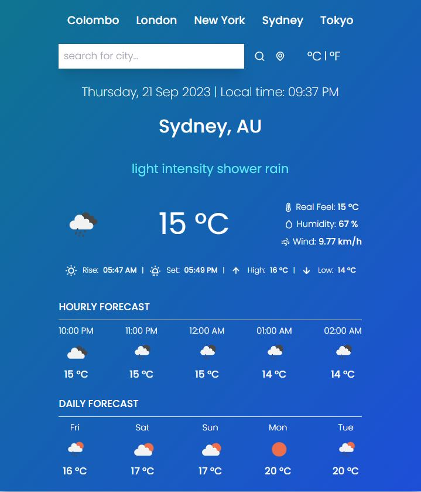

# Weather Forecast React App

## Overview

Welcome to the Weather Forecast React App! This application provides up-to-date weather information for locations worldwide. It's built using React and Tailwind CSS, and offers several features to help you stay informed about the weather conditions.

**Live Demo**: [Weather Forecast App Demo](https://rizmiya-weather-forecast.surge.sh/)

## Features

- **Temperature Units**: You can switch between Celsius and Fahrenheit to view temperature data in your preferred units.

- **Current Location Forecast**: The app automatically detects your current location and provides the latest weather forecast, so you're always in the know about local conditions.

- **Search Bar**: Easily search for weather forecasts in any location worldwide. Just enter the city or location name, and the app will fetch the forecast for you.

- **Daily Forecast**: Get daily weather forecast for the next 5 days, including temperature and weather conditions.

- **Hourly Forecast**: Stay prepared with a 5-hourly weather forecast for the next 5 hours, so you can plan your activities with confidence.

## Acknowledgments

This project relies on data provided by [OpenWeatherMap](https://openweathermap.org/) 

