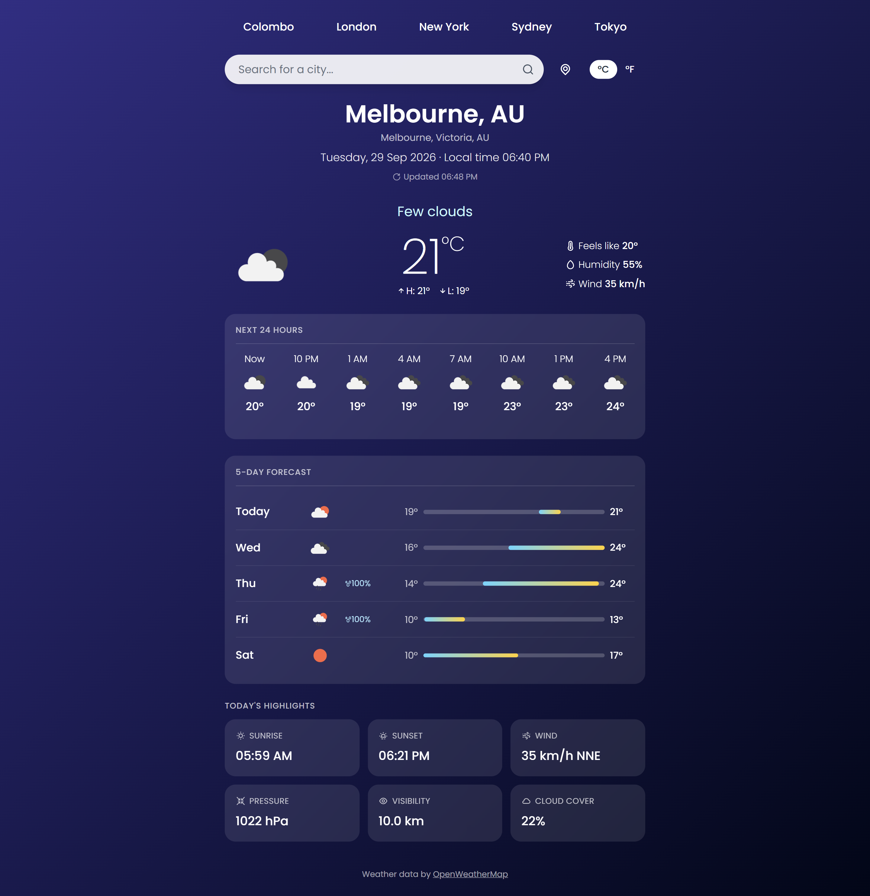
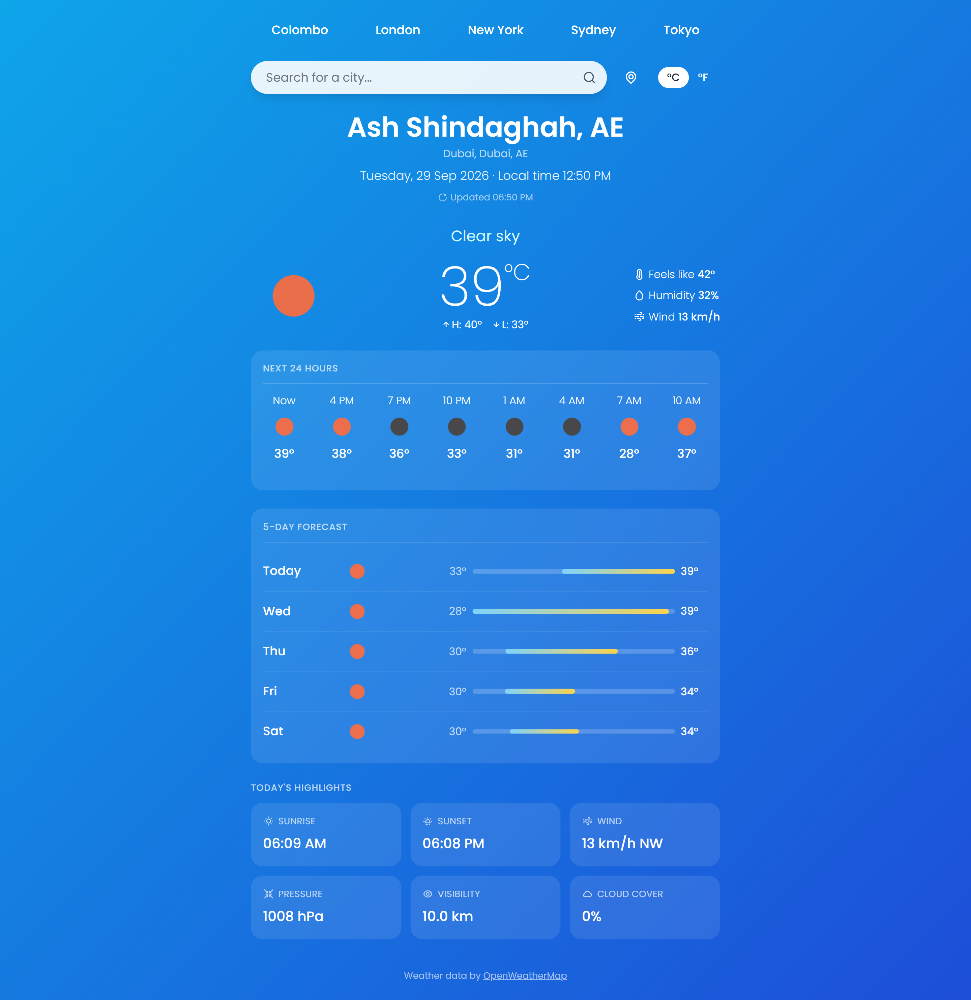

# Weather Forecast React App




## Overview

Welcome to the Weather Forecast React App! This application provides up-to-date weather information for locations worldwide. It's built using React and Tailwind CSS, and offers several features to help you stay informed about the weather conditions.

**Live Demo**: [Weather Forecast App Demo](https://rizmiya-weather-forecast.surge.sh/)

## Features

- **City search with autocomplete**: Suggestions appear as you type (keyboard navigation supported). Press Enter to search by name.
- **Current location**: One click uses your browser's location to show the weather where you are.
- **Current conditions**: Temperature, feels-like, humidity, wind, and today's high/low.
- **Hourly forecast**: The next 24 hours in 3-hour steps, with chance of rain.
- **5-day forecast**: Daily highs and lows with a temperature range bar, conditions, and chance of rain.
- **Today's highlights**: Sunrise, sunset, wind direction and gusts, pressure, visibility, and cloud cover.
- **Celsius / Fahrenheit**: Wind and visibility switch units too (km/h and km, or mph and mi).
- **Condition-aware backgrounds**: The background changes with the weather and time of day.
- **Remembers your choices**: Your last location and units are kept betwith a retry button.

## Getting Started

1. Get a free API key from [OpenWeatherMap](https://home.openweathermap.org/api_keys).
2. Create a `.env.local` file in the project root:

   ```
   REACT_APP_WEATHER_API_KEY=your_api_key_here
   ```

3. Install and run:

   ```
   yarn install
   yarn start
   ```

The app uses only free-tier OpenWeatherMap endpoints: Current Weather, 5 Day / 3 Hour Forecast, and Geocoding.

## Acknowledgments

This project relies on data provided by [OpenWeatherMap](https://openweathermap.org/)
